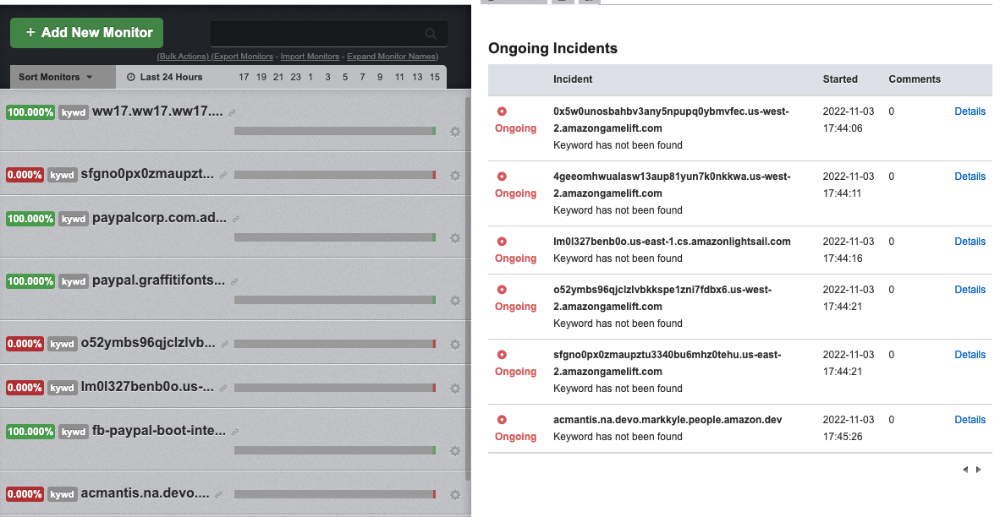

# Hunting Automation

本リポジトリをクローンしてセットアップを完了させれば、
フィッシングサイトのハンティングを自動化することができます。

## 動作に必要な情報
以下のサービスに登録しAPIキーを取得してください。

* [phishing-hunter](https://phishing-hunter.com)
	* API Key
* [ngrok](https://ngrok.com/)
	* API Key
	* Auth Key
* [urlscan.io](https://urlscan.io/)
	* API Key
* [gitlab.com](https://gitlab.com/)
	* API Key
* [UptimeRobot](https://uptimerobot.com/) (オプション)
	* API Key
* [Shodan](https://www.shodan.io) (オプション)
	* API Key

## 環境変数の設定

### 必須
```bash
$ echo "NGROK_AUTH=ngrokのauth key" > .env
$ echo "NGROK_API=ngrokのAPI key NGROK_AUTHではありません" >> .env
$ echo "API_BASE_URL=https://api.phishing-hunter.com/v1" >> .env
$ echo "PH_API_KEY=phishing hunter のAPIキー" >> .env
$ echo "URLSCAN_API=urlscan.ioのAPIキー" >> .env
$ echo "GITLAB_PROJECT_ID=プロジェクトID" >> .env
$ echo "GITLAB_ACCESS_TOKEN=パーソナルアクセストークン" >> .env
```

### オプション
```bash
$ echo "UPTIMEROBOT_API_KEY=uptimebot.comのAPIキー" >> .env
$ echo "SHODAN_API_KEY=shodanのAPIキー" >> .env
```

## 監視キーワードの設定
```
$ cp config.yml.template config.yml
$ vim config.yml
```

## dockerの起動
```
$ docker-compose build
$ docker-compose up -d
```

## スクリーンショット


## 参考
* [巧妙化・国際化するオンライン詐欺やサイバー犯罪にどう対応していくのか？](https://github.com/vavenger/fighting-phishing-methods)
